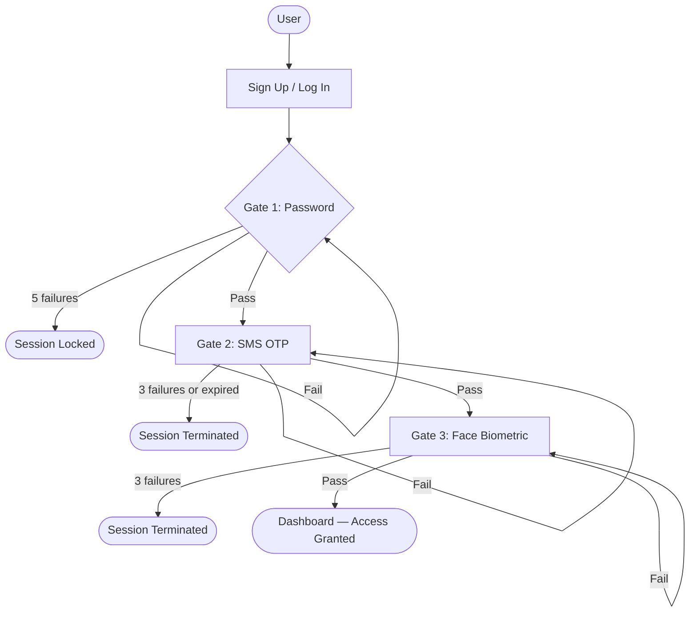

# Multi-Factor Authentication (MFA) System

A college major project implementing a **three-factor authentication system** built with Python and Flask. Each login attempt must pass three independent security gates — knowledge, possession, and inherence — before access is granted.

---

## Table of Contents

- [Overview](#overview)
- [Authentication Flow](#authentication-flow)
- [Key Features](#key-features)
- [Technology Stack](#technology-stack)
- [Project Structure](#project-structure)
- [Installation and Setup](#installation-and-setup)
- [Environment Variables](#environment-variables)
- [Database Setup](#database-setup)
- [Running the Application](#running-the-application)
- [API Routes](#api-routes)
- [Security Mechanisms](#security-mechanisms)
- [Team Development](#team-development)
- [Future Enhancements](#future-enhancements)
- [Disclaimer](#disclaimer)

---

## Overview

Single-password authentication is increasingly insufficient against modern threats such as credential stuffing, phishing, and brute-force attacks. This system addresses that by requiring users to prove their identity through **three separate, independent factors** before gaining access:

| Factor | Type | Implementation |
|--------|------|----------------|
| Gate 1 | **Knowledge** — something you know | Username + Password |
| Gate 2 | **Possession** — something you have | SMS One-Time Password (OTP) via Twilio |
| Gate 3 | **Inherence** — something you are | Facial biometric verification |

All three gates must be passed **in sequence** during every login. Failing any gate terminates the session and forces the user back to the beginning.

---

## Authentication Flow

### Registration

```
Sign Up (username + password)
    └─► SMS Setup (enter phone number → OTP sent via Twilio)
            └─► OTP Verification (confirm phone ownership)
                    └─► Face Registration (webcam capture → biometric stored)
                                └─► Account fully set up → Redirect to Login
```

### Login

```
Login (username + password)
    └─► Gate 1 PASSED → SMS OTP sent automatically to registered number
            └─► Gate 2 PASSED → Face verification page (webcam opens)
                    └─► Gate 3 PASSED → Dashboard (fully authenticated)
```

> Bypassing any gate is prevented by session sentinels (gate1_passed, gate2_passed, fully_authenticated). Attempting to access a later gate directly clears the session and redirects to login.

### Mermaid Diagram



---

## Key Features

- **Three-factor authentication** — password, SMS OTP, and facial biometric
- **Werkzeug password hashing** — passwords are never stored in plain text
- **Time-limited OTPs** — SMS codes expire after 10 minutes
- **Attempt lockouts** — Gate 1 locks after 5 failed attempts; Gates 2 and 3 terminate the session after 3 failures each
- **Gate sentinels** — Flask session flags prevent gate-skipping
- **AES-encrypted face encodings** — biometric data is encrypted with Fernet (AES-128-CBC) before being stored in the database
- **Async SMS dispatch** — OTP is sent in a background thread so the page loads immediately
- **OTP resend fallback** — users can request a fresh code if the original is lost
- **Input validation** — username length, password length, and required fields are validated server-side
- **Modular Flask Blueprints** — each authentication phase is an independent, self-contained module
- **Auto table creation** — db.create_all() creates the database schema on first run

---

## Technology Stack

| Layer | Technology |
|-------|------------|
| Language | Python 3 |
| Web Framework | Flask 3.1 |
| ORM | Flask-SQLAlchemy 3.1 / SQLAlchemy 2.0 |
| Database Driver | PyMySQL 1.1 |
| Database | MySQL |
| Password Hashing | Werkzeug Security |
| SMS Gateway | Twilio 9.10 |
| OTP Generation | Python random (6-digit numeric code) |
| Face Detection and Recognition | face_recognition 1.3 (dlib-based) |
| Computer Vision | OpenCV (opencv-python 4.13) |
| Biometric Encryption | cryptography (Fernet / AES) |
| Numerical Computing | NumPy 2.5 |
| Environment Config | python-dotenv |
| Templating | Jinja2 (via Flask) |
| Frontend | HTML, CSS, JavaScript |

---

## Project Structure

```
3fa_system/
│
├── run.py                        # Application entry point
├── requirements.txt              # Python dependencies
├── .env                          # Secret config (NOT committed to Git)
├── .gitignore
│
└── app/                          # Main application package
    ├── __init__.py               # App factory (create_app), Blueprint registration
    ├── models.py                 # SQLAlchemy User model
    │
    ├── phase1_basic/             # Gate 1 — Knowledge (password auth)
    │   ├── __init__.py
    │   └── routes.py             # /signup, /login, /logout, /
    │
    ├── phase2_otp/               # Gate 2 — Possession (SMS OTP)
    │   ├── __init__.py
    │   ├── otp_logic.py          # OTP generation and Twilio dispatch
    │   └── routes.py             # /setup-sms, /verify-sms, /login-sms, /resend-sms
    │
    ├── phase3_face/              # Gate 3 — Inherence (facial biometrics)
    │   ├── __init__.py
    │   ├── vision_logic.py       # face_recognition encode/verify + AES encryption
    │   └── routes.py             # /register-face, /login-face
    │
    ├── dashboard/                # Protected area — post-authentication
    │   ├── __init__.py
    │   └── routes.py             # /dashboard
    │
    ├── templates/                # Jinja2 HTML templates
    │   ├── signup.html
    │   ├── login.html
    │   ├── setup_sms.html
    │   ├── verify_sms.html
    │   ├── login_sms.html
    │   ├── register_face.html
    │   ├── login_face.html
    │   └── dashboard.html
    │
    └── static/
        ├── css/
        │   └── design_system.css
        └── js/
            └── capture_face.js   # Webcam capture logic (browser-side)
```

---

## Installation and Setup

### Prerequisites

- Python 3.10 or later
- MySQL Server running locally
- A [Twilio](https://www.twilio.com/) account (free trial works)
- A webcam (required for face registration and login)

### Clone and Install

```bash
git clone https://github.com/VaishnavKardile/MFA.git
cd MFA
python -m venv venv
venv\Scripts\activate
pip install -r requirements.txt
```

> **Note on dlib:** The dlib package (a dependency of face_recognition) requires C++ build tools. On Windows, install [CMake](https://cmake.org/) and the [Visual Studio Build Tools](https://visualstudio.microsoft.com/visual-cpp-build-tools/) before running pip install. Alternatively, a pre-compiled dlib-bin wheel is already listed in requirements.txt.

---

## Environment Variables

Create a .env file in the project root. **Never commit this file** — it is already listed in .gitignore.

```env
# MySQL connection string
DATABASE_URL=mysql+pymysql://<username>:<password>@localhost/<database_name>

# Flask session secret — generate a long random string
SECRET_KEY=your_secret_key_here

# Twilio credentials (from your Twilio console)
TWILIO_SID=your_twilio_account_sid
TWILIO_AUTH_TOKEN=your_twilio_auth_token
TWILIO_NUMBER=your_twilio_phone_number

# Fernet key for AES-encrypting face encodings at rest
# Generate with: python -c "from cryptography.fernet import Fernet; print(Fernet.generate_key().decode())"
AES_SECRET_KEY=your_fernet_key_here
```

| Variable | Purpose |
|----------|---------|
| DATABASE_URL | SQLAlchemy connection string to your MySQL database |
| SECRET_KEY | Flask session signing key — must be long and unpredictable |
| TWILIO_SID | Twilio Account SID for SMS |
| TWILIO_AUTH_TOKEN | Twilio authentication token |
| TWILIO_NUMBER | Verified Twilio phone number used as SMS sender |
| AES_SECRET_KEY | Fernet symmetric key used to encrypt face encodings before storage |

---

## Database Setup

The project uses **MySQL** via PyMySQL. The ORM is Flask-SQLAlchemy.

1. Create a MySQL database (any name you choose — use it in DATABASE_URL).
2. The application automatically creates all tables on first run via db.create_all().

The users table schema (from models.py):

| Column | Type | Description |
|--------|------|-------------|
| id | Integer (PK) | Auto-increment primary key |
| username | String(50), unique | Login username |
| password_hash | String(256) | Werkzeug-hashed password |
| totp_secret | String(32), nullable | Reserved column (currently unused) |
| face_encoding | Text, nullable | AES-encrypted face biometric |
| phone_number | String(20), nullable | Registered phone number for SMS OTP |

No manual SQL migrations are required for a fresh installation.

---

## Running the Application

```bash
python run.py
```

The Flask development server starts at:

```
http://127.0.0.1:5000
```

Visiting the root URL (/) automatically redirects to the login page.

---

## API Routes

### Phase 1 — Knowledge (Blueprint: phase1)

| Method | Route | Description |
|--------|-------|-------------|
| GET | / | Redirects to /login |
| GET / POST | /signup | New user registration (username + password) |
| GET / POST | /login | Password authentication — Gate 1 |
| GET | /logout | Clears session and redirects to login |

### Phase 2 — Possession (Blueprint: phase2)

| Method | Route | Description |
|--------|-------|-------------|
| GET / POST | /setup-sms/<username> | Registration: collect phone number and send OTP |
| GET / POST | /verify-sms/<username> | Registration: verify OTP and save phone number |
| GET / POST | /login-sms | Login: Gate 2 — SMS OTP verification |
| GET | /resend-sms/<username> | Request a fresh OTP code |

### Phase 3 — Inherence (Blueprint: phase3)

| Method | Route | Description |
|--------|-------|-------------|
| GET | /register-face/<username> | Registration: render webcam capture page |
| POST | /register-face | Registration: process and store encrypted face encoding |
| GET | /login-face | Login: Gate 3 — render biometric verification page |
| POST | /login-face | Login: Gate 3 — verify live face against stored encoding |

### Dashboard (Blueprint: dashboard)

| Method | Route | Description |
|--------|-------|-------------|
| GET | /dashboard | Protected dashboard — requires all three gates passed |

---

## Security Mechanisms

| Mechanism | Detail |
|-----------|--------|
| Password hashing | Passwords are hashed using Werkzeug's generate_password_hash (PBKDF2-HMAC-SHA256) before database storage |
| Session gate sentinels | gate1_passed, gate2_passed, and fully_authenticated flags prevent gate-skipping |
| Login attempt lockout | Gate 1 resets the session after 5 consecutive failed password attempts |
| OTP expiry | SMS codes are valid for 10 minutes; expired codes are rejected |
| OTP attempt lockout | Gate 2 terminates the session after 3 incorrect code entries |
| Biometric attempt lockout | Gate 3 terminates the session after 3 failed face matches |
| AES encryption at rest | Face encodings are encrypted with Fernet (AES-128-CBC + HMAC) before being stored in the database |
| Environment variable secrets | All credentials (SECRET_KEY, Twilio keys, AES key, DB URL) are loaded from .env and never hard-coded |
| Session isolation | session.clear() is called on any security violation to remove all session state |
| Multi-face rejection | The face capture rejects frames containing zero or more than one face |

---

## Team Development

Repository: https://github.com/VaishnavKardile/MFA

**Recommended workflow for collaborators:**

1. Never push directly to main.
2. Create a feature branch for each change:
   ```bash
   git checkout -b feature/your-feature-name
   ```
3. Push your branch and open a **Pull Request** for review.
4. The .env file is intentionally excluded from Git — share credentials through a secure, out-of-band channel (e.g., a private password manager).

---

## Future Enhancements

The following are potential improvements that do **not** currently exist in the codebase:

- **TOTP / Authenticator app support** — the totp_secret column is already in the schema and pyotp is installed; TOTP logic is not yet wired up
- **Rate limiting** — IP-based throttling to further slow brute-force attempts (e.g., Flask-Limiter)
- **HTTPS enforcement** — TLS certificate configuration for production deployment
- **Account lockout persistence** — storing lockout state in the database rather than the session, so lockouts survive server restarts
- **Admin dashboard** — user management interface for administrators
- **Liveness detection** — preventing spoofing via a static photo during face verification
- **Email verification** — optional additional factor or account recovery mechanism
- **Containerisation** — Docker Compose setup for reproducible deployment

---

## Disclaimer

This project was developed as a **college major project** for educational purposes. While it demonstrates real authentication concepts and uses production-grade libraries, it has not undergone a formal security audit. It should **not** be deployed in a production environment without thorough security review, penetration testing, and hardening.
